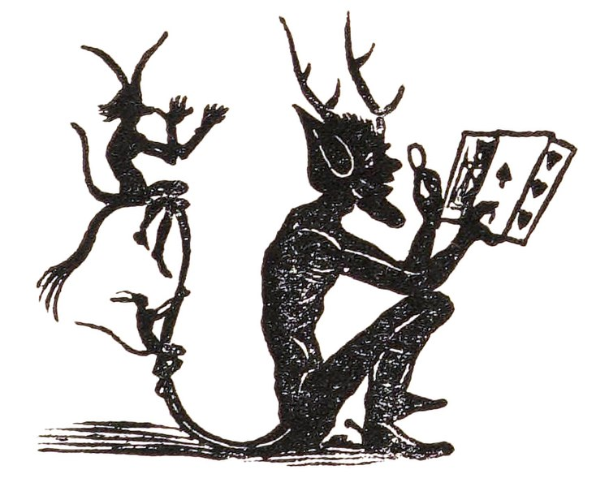

<!-- README.md is generated from README.Rmd. Please edit that file -->

```{r, include = FALSE}
knitr::opts_chunk$set(
  collapse = TRUE,
  comment = "#>",
  fig.path = "man/figures/README-",
  out.width = "100%"
)
```

# ympes

<!-- badges: start -->
[](https://github.com/TimTaylor/ympes/actions/workflows/R-CMD-check.yaml){.pkgdown-devel}
[](https://CRAN.R-project.org/package=ympes){.pkgdown-release}
<!-- badges: end -->

ympes provides a collection of lightweight helper functions (imps) both for
interactive use and for inclusion within other packages. These include functions
for visualising colour palettes, quoting user input, searching rows of a data
frame and a set of minimal assertion functions.

```{r, fig.alt = "Illustration of an imp looking at a hand of playing cards. Published on page 193 of Le grand Etteilla, ou, l'art de tirer les cartes.", out.width="100%", echo=FALSE}

```

You can install the released version of ympes from [CRAN](https://cran.r-project.org/) with:

```{r, eval = FALSE}
install.packages("ympes")
```


::: {.pkgdown-devel}
The development version of ympes can be installed from GitHub with:
```{r, eval = FALSE}
remotes::install_github("TimTaylor/ympes")
```
:::


___

Image from [Le grand Etteilla, ou, l'art de tirer les cartes](https://archive.org/details/b29321220/page/192/mode/2up).
Author Simon Blocquel (1780–1863, under the pseudonym Julia Orsini). B+W version
(and details) obtained from
[wikipedia](https://commons.wikimedia.org/wiki/File:Imp_with_cards_-_illustration_from_Le_grand_Etteilla.jpg).
